<div align="center">

[](https://myanmar-weather-dashboard.onrender.com/)
[](https://myanmar-weather-dashboard.onrender.com/ai)
[](https://nodejs.org/)
[](#)
[](LICENSE)

**မြန်မာတစ်နိုင်ငံလုံးအတွက် လှပတိကျတဲ့ မိုးလေဝသဒက်ရှ်ဘုတ် — AI ခန့်မှန်းချက်တွေနဲ့အတူ**

*A beautiful bilingual weather dashboard for Myanmar, with AI-powered climate forecasts.*

[🚀 Live Demo](https://myanmar-weather-dashboard.onrender.com/) ·
[🤖 AI Forecast](https://myanmar-weather-dashboard.onrender.com/ai) ·
[🗺️ Map](https://myanmar-weather-dashboard.onrender.com/map) ·
[⚠️ Alerts](https://myanmar-weather-dashboard.onrender.com/alerts)

</div>

---

## ✨ Features · လုပ်ဆောင်ချက်များ

| | |
|---|---|
| 🏠 **Dashboard** | လက်ရှိရာသီဥတု၊ ၂၄ နာရီခန့်မှန်းချက်၊ ၇ ရက်ခန့်မှန်းချက်၊ ၁၂ မြို့လုံးခြုံငုံသုံးသပ်ချက် — current conditions, hourly & 7-day forecasts, 12-city overview |
| 🤖 **AI Forecast** | GPT / Claude model ၅ မျိုးနဲ့ မိုးလေဝသခန့်မှန်းချက်၊ ရာသီဥတုခန့်မှန်းချက်၊ နက်ရှိုင်းတဲ့သုံးသပ်ချက် — professional chart တွေပါတဲ့ bilingual report + PDF |
| 🔍 **Search** | ၁၂ မြို့ local search + Open-Meteo geocoding (Myanmar-biased), မကြာသေးမီကရှာဖွေမှုများ |
| ⚠️ **Alerts** | မိုးကြိုး၊ မိုးကြီး/ရေကြီး၊ အပူလှိုင်း၊ လေပြင်း၊ အအေးပိုင်း သတိပေးချက်များ + admin announcements |
| 🗺️ **Map** | အပူချိန် / မိုး / လေ / သတိပေးချက် layer တွေနဲ့ interactive map |
| ❤️ **Favorites** | မြို့တွေသိမ်း၊ နှိုင်းယှဉ်၊ အစဉ်လိုက်၊ default သတ်မှတ် |
| 🎨 **Design** | Glassmorphism, gradient icon rail, light/dark/system theme, မြန်မာ default |
| 🛡️ **Resilience** | Server-side cache + MET Norway fallback + circuit breaker — provider ကျသွားလည်း data မပြတ် |

## 🤖 AI မိုးလေဝသခန့်မှန်းချက်

`/ai` မှာ model ၅ မျိုးထဲကရွေးပြီး သုံးသပ်ချက်ထုတ်နိုင်တယ် —
`gpt-5.6-sol` · `claude-fable-5` · `claude-opus-5` · `claude-sonnet-5` · `claude-fable-5.1`

- 🔑 API key ကို `/ai/setup` မှာထည့် — **AES-256-GCM** နဲ့ encrypt, server-side ပဲခေါ်တယ်၊ frontend ကိုဘယ်တော့မှမရောက်
- 📊 Report တိုင်းမှာ **chart ၄ ခု** (၇ ရက်အပူချိန်၊ ၂၄ နာရီမျဉ်း၊ မိုးရွာနိုင်ခြေ၊ လေတိုက်နှုန်း) + **KPI card ၆ ခု** + ၇ ရက်ဇယား + ရာသီဥတုနှိုင်းယှဉ်ချက်
- 🖨️ **Print → PDF** — မြန်မာစာအက္ခရာပုံမှန်ထွက်တဲ့ A4 professional report
- 🌧️ မြန်မာ့ရာသီဥတုဗဟုသုတ (မုတ်သုံ၊ ဆိုင်ကလုန်းရာသီ၊ ENSO၊ စိုက်ပျိုးရေးပြက္ခဒိန်) နဲ့ prompt တိုင်းကို grounding လုပ်ထားတယ်
- 📅 တစ်နေ့ ၁၀ ကြိမ် (configurable)

## 🚀 Quick Start

Requires **Node.js 22.5+** (`node:sqlite`).

```bash
npm install
npm start
```

Open http://localhost:3200 (override with `PORT`). SQLite DB auto-created at `data/app.db` (WAL mode, gitignored) and seeded with 12 cities + an admin account (`admin@example.com` — ⚠️ change the default password immediately).

## ⚙️ Environment Variables

| Variable | Default | Description |
|---|---|---|
| `PORT` | `3200` | HTTP port |
| `AI_API_BASE` | `https://claude-n-codex.com:8443/v1` | AI gateway (Anthropic-format) |
| `AI_KEY_SECRET` | *(random per boot)* | Encrypts stored API keys — **set this in production**, or keys break on restart |
| `AI_DAILY_LIMIT` | `10` | AI analyses per user per day |

## 🏗️ Project Structure

```
src/
  server.js        entry: boots DB, seeds, starts Express
  app.js           Express app factory + middleware
  db.js            node:sqlite schema + seed
  auth.js          scrypt hashing, session cookies, roles
  ai/              models.js, crypto.js (AES-256-GCM), snapshot.js, charts.js (SVG)
  weather/         open-meteo.js, metno.js (fallback), codes.js, service.js (cache + circuit breaker)
  views/           layout.js, widgets.js, icons.js, pages/*.js (server-rendered HTML)
  routes/          pages.js, auth.js, api.js, ai.js
public/
  css/style.css    hand-written, glassmorphism, dark mode, A4 print styles
  js/              vanilla JS, no build step
assets/            README banner + footer art (animated SVG)
```

## 🛣️ Roadmap

- [ ] 📧 Email alerts (verification, password reset, alert emails)
- [ ] 🌱 Agricultural insights for farmers
- [ ] 🧳 Travel planner
- [ ] 🔔 Push notifications + 📱 PWA
- [ ] 👥 Community weather reports

## 🤝 Contributing

PR တွေကြိုဆိုပါတယ်! *PRs welcome.*

1. Fork the repo
2. Create a feature branch (`git checkout -b feature/amazing`)
3. Commit (`git commit -m 'Add amazing feature'`)
4. Push & open a Pull Request

## 📄 License

MIT — see [LICENSE](LICENSE).

---

<div align="center">

<br/>
Made with ☀️ in Myanmar
</div>
